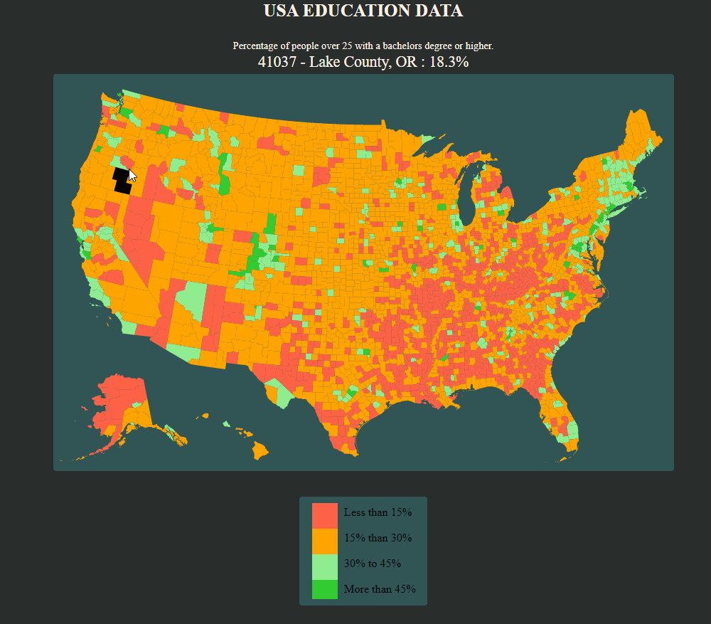

# US Education Level Map
<html>
<!-- Project Shields -->
<!-- Project Shields -->
    

        
		¨
        
		
        ¨
        
        ¨
        
        ¨
        
    
 
</html>

## Table of Contents
+ [About](#about)
+ [Prerequisites](#prerequisites)
+ [Getting Started](#getting_started)
+ [Quick Look](#quick_look)
+ [Web-hosted](#hosted)

## About 
This project is intended to provide an insight into US education level across the US by county.

### Prerequisites

* Web Browser
* Node.js
* NPM
* Webpack

## Getting Started 
Use a command line/Bash to move to the project directory with cd project-directory-here

1. Clone the repository: $ `git clone https://github.com/romankolivashko/educationMap.git`
2. Navigate to the educationMap/ directory on your computer
3. Run `npm install` in command line/Bash to get all dependencies.
4. Run `npm run start` in command line/Bash to start up the program in your browser.

### Quick look 

### Hosted online 
[Link](https://zealous-jones-c5db9a.netlify.app/)

## Known Bugs

[Issues](https://github.com/romankolivashko/educationMap/issues)

## License
MIT

## Contact Information
rkolivashko@gmail.com
